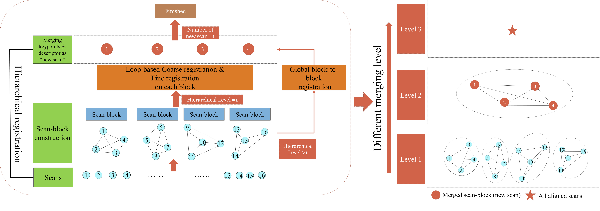
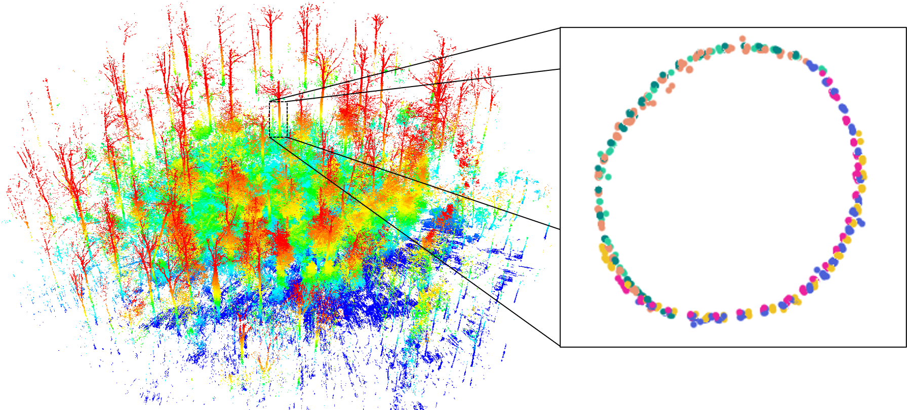
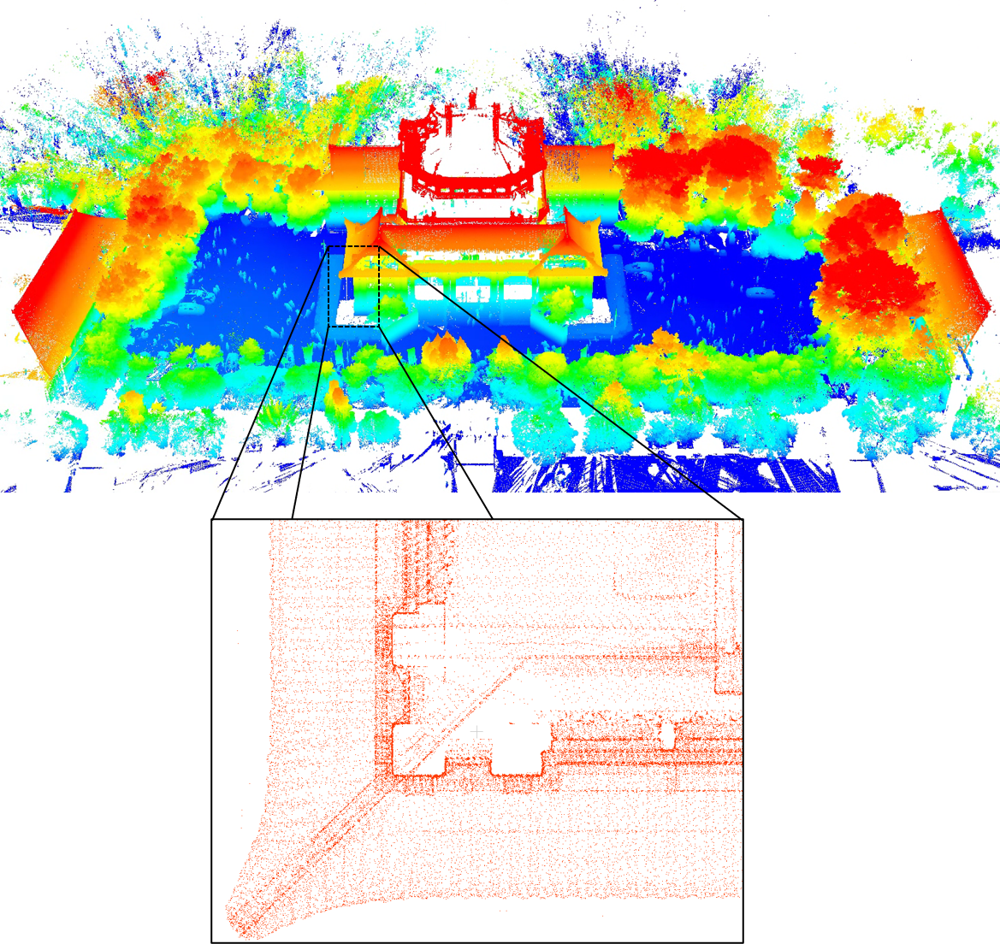

# HL-MRF
- [HL-MRF](#hl-mrf)
  - [News](#news)
  - [Hierarchical Loop-based Multiview Registration Framework](#hierarchical-loop-based-multiview-registration-framework)
  - [Demo](#demo)
    - [Pipline](#pipline)
    - [ETH TLS Datasets](#eth-tls-datasets)
    - [Robotic 3D Scan datasets](#robotic-3d-scan-datasets)
    - [WHU TLS datasets](#whu-tls-datasets)
  - [How to use](#how-to-use)
    - [1. Pre-requisite](#1-pre-requisite)
    - [2. Compile](#2-compile)
    - [3. run](#3-run)
    - [4. parameter configuration](#4-parameter-configuration)
    - [5. Data preparation](#5-data-preparation)
  - [Paper](#paper)
  - [Contributor](#contributor)
  - [Contact](#contact)
## News
* [2022-11-19] The paper has been published online! Check [here](https://authors.elsevier.com/a/1g6bm_L0-WAwZZ) to get it.
* [2022-11-8] Our paper has been accpeted by ***ISPRS*** (International Society for Photogrammetry and Remote Sensing) !
* [2022-5-27] Submit the manuscript to the journal.

## Hierarchical Loop-based Multiview Registration Framework
HL-MRF can automatically perform the point-cloud-based registration for large-scale TLS scans without any artificial target. The main focus of our framework lies in the efficiency of processing large-scale TLS scans and being able to tolerate pairwise registration failure for robustness. The proposed hierarchical registration strategy and the loop-based coarse registration method deal with them respectively.

Two key features in HL-MRF are:
> * An internal scan-block and block-to-block registration strategy to hierarchically align point clouds of large-scale TLS scans.
> * A loop-based coarse registration method to remove grossly wrong pairwise registration results caused by ambiguous scanning content.



## Demo
### Pipline

### ETH TLS Datasets


### Robotic 3D Scan datasets


### WHU TLS datasets



## How to use
The code was tested on Windows (Visual Studio 2021) and Ubuntu 18.04
### 1. Pre-requisite
   * [CMake](https://cmake.org/) version 2.8 or above
   * [PCL](https://github.com/PointCloudLibrary/pcl) version 1.11.0 (other versions may also work)
   * [Boost](https://github.com/boostorg/boost) version 1.65 or above
### 2. Compile
Clone this repository

```
git clone https://github.com/WuHao-WHU/HL-MRF.git
cd HL-MRF
mkdir build
cd build
cmake ..
make
```

### 3. run
On Ubuntu
```
cd ..
sh script/run.sh
```
On Windows, you can refer to `run.sh` to pass parameters in Visual Studio

### 4. parameter configuration
```
#./script/run.sh
# TLS input path
    path_dir=../scans/;#input directory
    out_dir=../result;#output directory
#parameters
	block_size=5;              # block size for hierarchical regisration (default: 5)
    downsample_size=0.1;       # downsample size of input TLS scans for coarse registration (default: 0.1 m)
	downsample_size_icp=0.1;   # distance of searching corresponding point in icp (default: the same as ${downsample_size})
	lum_iter=3;                # number of iteration for lum optimization (default: 3)
	t_MCS=10;                  # threshold of MCS (default: 10)
	number_of_threads=16;      # number of threads you use (default: 16)
	visualize_each_block=0;    # visualize each scan-block (default: 0)
```
### 5. Data preparation
You can test on the open-source TLS dataset: [WHU-TLS](http://3s.whu.edu.cn/ybs/en/benchmark.htm), [Robotic 3D Scan datasets](http://kos.informatik.uni-osnabrueck.de/3Dscans/), [ETH Dataset](https://prs.igp.ethz.ch/research/completed_projects/automatic_registration_of_point_clouds.html).

You can also use your own data and edit the ``path_dir`` in ``run.sh``.

The framework supports `*.ply`, `*.pcd` formats of point cloud data. You may need to transform other formats to the supported formats.


## Paper
If you find out our code useful in your research, please cite
```
@article{WU202365,
          title = {A hierarchical multiview registration framework of TLS point clouds based on loop constraint},
          author = {Hao Wu and Li Yan and Hong Xie and Pengcheng Wei and Jicheng Dai},
          journal = {ISPRS Journal of Photogrammetry and Remote Sensing},
          volume = {195},
          pages = {65-76},
          year = {2023}
}

@article{Yan2022,
          archivePrefix = {arXiv},
          arxivId = {2205.07404},
          author = {Yan, Li and Wei, Pengcheng and Xie, Hong and Dai, Jicheng and Wu, Hao and Huang, Ming},
          eprint = {2205.07404},
          pages = {1--16},
          title = {A New Outlier Removal Strategy Based on Reliability of Correspondence Graph for Fast Point Cloud Registration},
          year = {2022}
}

@article{theiler2015globally,
          title={Globally consistent registration of terrestrial laser scans via graph optimization},
          author={Theiler, Pascal Willy and Wegner, Jan Dirk and Schindler, Konrad},
          journal={ISPRS journal of photogrammetry and remote sensing},
          volume={109},
          pages={126--138},
          year={2015},
          publisher={Elsevier}
}
```
## Contributor
[Hao Wu (吴豪)](https://github.com/WuHao-WHU)，[Pengcheng Wei (韦朋成)](https://github.com/WPC-WHU)

## Contact 
Email: haowu2021@whu.edu.cn

Do not hesitate to contact the authors if you have any question or find any bugs.

